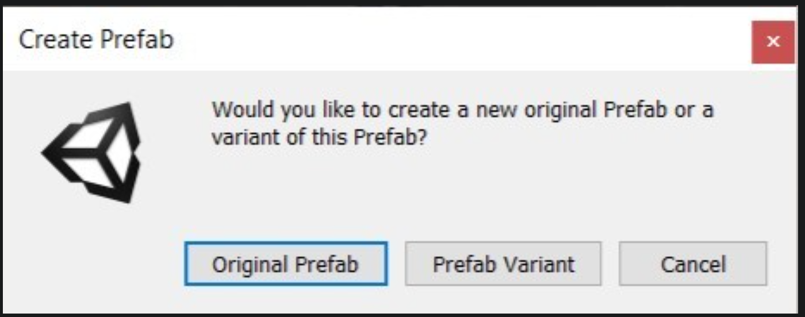
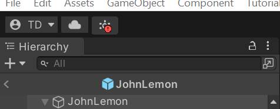
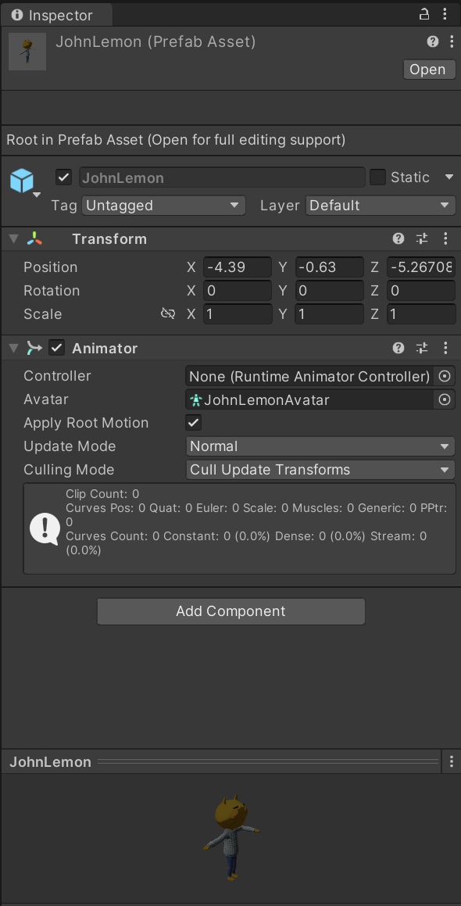
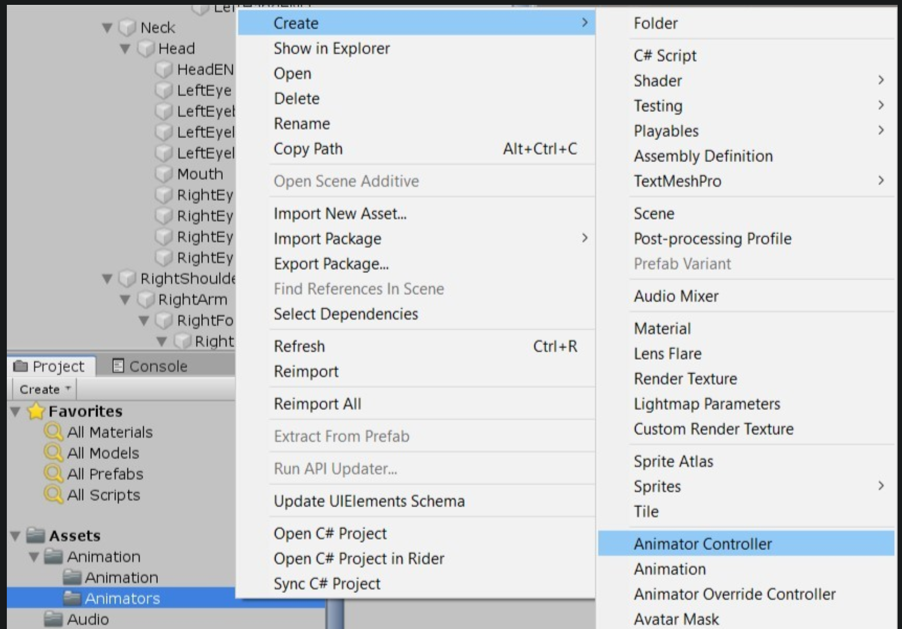
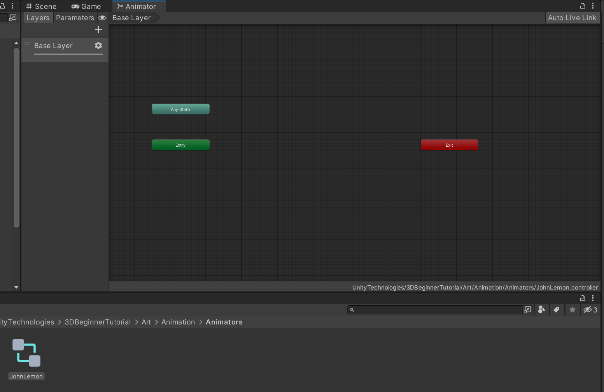
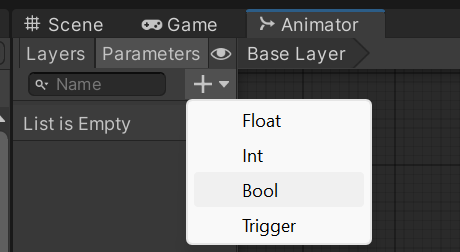

# -- Haunted Jaunt --
## Link Tuto:
https://learn.unity.com/tutorial/the-player-character-part-1?uv=2020.3&projectId=5caf65ddedbc2a08d53c7acb#61680ef8edbc2a00215ba6a7
## Link Asset:
https://assetstore.unity.com/packages/essentials/tutorial-projects/unity-learn-3d-beginner-tutorial-resources-urp-143848

## Useful trick:
- With your cursor over the Scene view, press F to focus.
-  In the Hierarchy, select the Root GameObject. Hold Alt (Windows) and click the arrow to the left of its name to expand all its child GameObjects.
-  

## Learning:
- The first use for this system in your Project will be to make the character a Prefab.  This means that if you go on to make multiple levels for the game, you won’t need to remake JohnLemon for every level — you can just instantiate a new Prefab. Prefabs can be identified in the Hierarchy window by their blue name and icon.
- 6. Turn the Character into a Prefab
  -  1.  Drag the GameObject from the Hierarchy into the Assets > Prefabs folder in the Project window.  A dialogue box will appear asking if you want to make an Original Prefab or a Prefab Variant — select Original Prefab. 
  -  2.  Now the JohnLemon Prefab has been created, any changes you make to that Prefab will be reflected on the instance of the JohnLemon Prefab in the Scene.  
  -  3.  In the Inspector window, click the Open Prefab button.
  -  4.  Disable the Auto Save checkbox (enabling this will slow you down). A Save button will appear so you can manually save any changes that you make to the Prefab.
  -  5. On the left is an arrow which will take you back along the breadcrumb.  If you clicked the arrow now, it would take you back to MainScene. 
- 7. Animate your character
  -  Select the JohnLemon GameObject and take a look at its Animator component in the Inspector. The first property is called Controller.  This takes a reference to a type of Asset called an Animator Controller, which you’re going to use to get JohnLemon moving. Animator Controllers contain a state machine which determines what animation the Animator component should be setting for its hierarchy at any given time.  This animation is based on animation clips which have been set up on the Animator Controller.  
- 8. Create the Animator Controller  
  -  
  - 2.  Name the Animator Controller "JohnLemon", then double click on it to open it for editing in the Animator window. 
  - 3.  Click the Parameters tab on the top left of the Animator window. 
        - The Animator Controller’s state machine makes decisions based on the current values of its Animator Parameters.  These Animator Parameters have values set by script. You will need one parameter for every independent variable which can affect the animation that the character is playing.  
        - JohnLemon is going to have two animations: an idle animation for when it is not moving and a walking animation for when it is. So there are two states it could be in: walking or not walking.
        - There are four types of parameter: 
            - A float parameter has the value of a floating point variable (a number with a decimal place).
            - An int parameter has the value of an integer (a number without a decimal place).  
            - A bool parameter has the value of a boolean (which can be either true or false).
            - A trigger parameter is a special type of parameter which doesn’t hold a value — this causes a change from one animation to another.  
        - In this case, you know that the character is either walking or stationary, so a bool parameter makes the most sense. 
  - 4. Name the new Animator Parameter "IsWalking". It’s important to get the spelling and capitalisation exactly right — you’ll understand why in the next tutorial when you write your first script. To the right of the name of the IsWalking parameter is a disabled checkbox. This is the default value for the parameter.  Without player input your character is going to be stationary, so IsWalking should be false. This means you don’t need to change anything here.

