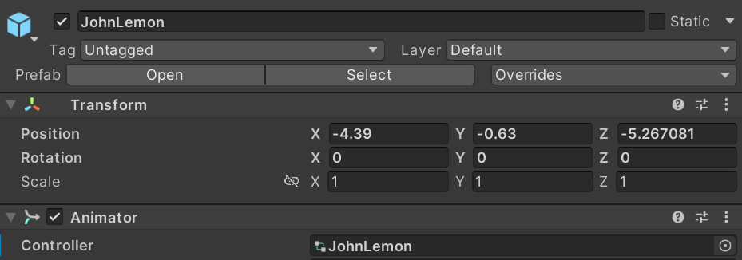

# -- Haunted Jaunt --
## Link Tuto:
https://learn.unity.com/tutorial/the-player-character-part-1?uv=2020.3&projectId=5caf65ddedbc2a08d53c7acb#61680ef8edbc2a00215ba6a7
## Link Asset:
https://assetstore.unity.com/packages/essentials/tutorial-projects/unity-learn-3d-beginner-tutorial-resources-urp-143848

## Useful trick:
- With your cursor over the Scene view, press F to focus.
-  In the Hierarchy, select the Root GameObject. Hold Alt (Windows) and click the arrow to the left of its name to expand all its child GameObjects.
-  

## Learning:
- The first use for this system in your Project will be to make the character a Prefab.  This means that if you go on to make multiple levels for the game, you won’t need to remake JohnLemon for every level — you can just instantiate a new Prefab. Prefabs can be identified in the Hierarchy window by their blue name and icon.
### 6. Turn the Character into a Prefab
  -  1.  Drag the GameObject from the Hierarchy into the Assets > Prefabs folder in the Project window.  A dialogue box will appear asking if you want to make an Original Prefab or a Prefab Variant — select Original Prefab. 
  -  2.  Now the JohnLemon Prefab has been created, any changes you make to that Prefab will be reflected on the instance of the JohnLemon Prefab in the Scene.  
  -  3.  In the Inspector window, click the Open Prefab button.
  -  4.  Disable the Auto Save checkbox (enabling this will slow you down). A Save button will appear so you can manually save any changes that you make to the Prefab.
  -  5. On the left is an arrow which will take you back along the breadcrumb.  If you clicked the arrow now, it would take you back to MainScene. 
### 7. Animate your character
  -  Select the JohnLemon GameObject and take a look at its Animator component in the Inspector. The first property is called Controller.  This takes a reference to a type of Asset called an Animator Controller, which you’re going to use to get JohnLemon moving. Animator Controllers contain a state machine which determines what animation the Animator component should be setting for its hierarchy at any given time.  This animation is based on animation clips which have been set up on the Animator Controller.  
### 8. Create the Animator Controller  
  -  
  - 2.  Name the Animator Controller "JohnLemon", then double click on it to open it for editing in the Animator window. 
  - 3.  Click the Parameters tab on the top left of the Animator window. 
        - The Animator Controller’s state machine makes decisions based on the current values of its Animator Parameters.  These Animator Parameters have values set by script. You will need one parameter for every independent variable which can affect the animation that the character is playing.  
        - JohnLemon is going to have two animations: an idle animation for when it is not moving and a walking animation for when it is. So there are two states it could be in: walking or not walking.
        - There are four types of parameter: 
            - A float parameter has the value of a floating point variable (a number with a decimal place).
            - An int parameter has the value of an integer (a number without a decimal place).  
            - A bool parameter has the value of a boolean (which can be either true or false).
            - A trigger parameter is a special type of parameter which doesn’t hold a value — this causes a change from one animation to another.  
        - In this case, you know that the character is either walking or stationary, so a bool parameter makes the most sense. 
  - 4. Name the new Animator Parameter "IsWalking". It’s important to get the spelling and capitalisation exactly right — you’ll understand why in the next tutorial when you write your first script. To the right of the name of the IsWalking parameter is a disabled checkbox. This is the default value for the parameter.  Without player input your character is going to be stationary, so IsWalking should be false. This means you don’t need to change anything here.
### 9.Set Up the Animations
- In order to use those animations in your Animator Controller, drag them from the Project window to the Animator window.

- The default state is displayed in orange.  In this case, the default state is Idle because you dragged it in first. The default state can be changed by right clicking on a state and selecting Set As Layer Default State.
### 10.Create Animator Transitions
- 1.  Right click on the Idle state and select Make Transition. This starts a transition that follows the mouse cursor. 
   
- 2.  Your character needs to be able to change back to idle from walking, so repeat this process to create a transition from Walk to Idle.
  
- 3.  The state machine now has a way of transitioning between the two animations, but it doesn’t yet know when to transition.  Remember creating the IsWalking parameter?  This is what you will use to determine whether the state machine should change animation or stay on the same one.
Select the transition from Idle to Walk by clicking on the connecting line.
  
-  In the Inspector, look at the settings for this transition. The first thing you need to change is the Has Exit Time checkbox.
  If Has Exit Time is true (the checkbox is enabled) then after a certain amount of time has passed the transition will automatically be taken and the state machine will play the next state.  In this game it’s important to control when the transition is taken, so disable the Has Exit Time checkbox.
  Further down the Inspector window, there will now be a warning saying "Transition needs at least one condition or an Exit Time to be valid, otherwise it will be ignored."  Because you just disabled the Has Exit Time checkbox, there is currently no reason to ever take this transition.  You need to provide one by adding a Condition.
  
### 11. Add Conditions to your Transition
- 1.  Click the + button beneath the (currently empty) Conditions list. 
  
- 2.  The transition from Idle to Walk is required when the character is walking — that is, when IsWalking is true. The default Condition created is actually just what you need here: if IsWalking is true, JohnLemon should transition from Idle to Walk. You don’t need to change anything!

- 3. Do da same with Walf->Idle but this time isWalking = false

### 12. Assign the Animator Controller to the JohnLemon Prefab
You still need to tell the JohnLemon Prefab that this is the Animator Controller it should use:
- 1.  In the Project window, to go Assets > Animation > Animators and find the JohnLemon Animator Controller. 

- 2.  Select the JohnLemon GameObject in the Hierarchy, then drag the Animator Controller to the Controller property of its Animator component in the Inspector. This is a very important step; without it, JohnLemon won’t be able to move.

### 13.Make your Character React to Physics
1.  Open the JohnLemon Prefab for editing in Prefab Mode. In the Inspector, you’ll find two components: a Transform and an Animator.  In order to react to physics your character needs two more components: a Rigidbody and a Collider.
A Rigidbody component marks a GameObject as something that is part of the physics system that can move.  Since you definitely want your character to be able to move and we want them to bump into walls (therefore to be part of the physics system), the JohnLemon GameObject needs a Rigidbody component.
2. Click the Add Component button. 

This is a 3D Project, so make sure that you click on Rigidbody and not Rigidbody 2D.
3.  Now you have given the JohnLemon Prefab a Rigidbody component, it will react to physics effects such as gravity.  Let’s enter Play Mode and see that in action. Return to the MainScene by clicking on Scenes at the top of the Scene view, then press the Play button on the toolbar.
Hmmm, that’s not quite right: the character falls a short distance then stops. Press the Play button again to exit Play Mode.
This is being cased by the Animator.  The third property on the Animator component is Apply Root Motion, which is currently enabled. 
### 14.What is Root Motion?
- Apply Root Motion is enabled on your Animator component, so any movement of the root in the animation will be applied every frame.  Since the Animator is playing Idle there is no movement, so the Animator will apply no movement.    So why does the JohnLemon GameObject move at all?  This is due to the Update Mode of the Animator.
### 15.What is the Update loop?
- An Animator component can change when it performs its Update. By default it performs this in line with rendering.  This means that the Animator is moving the character in Update and the Rigidbody is simultaneously moving the character in Fixed Update.  This is what’s causing your problem, and it can easily be fixed!  